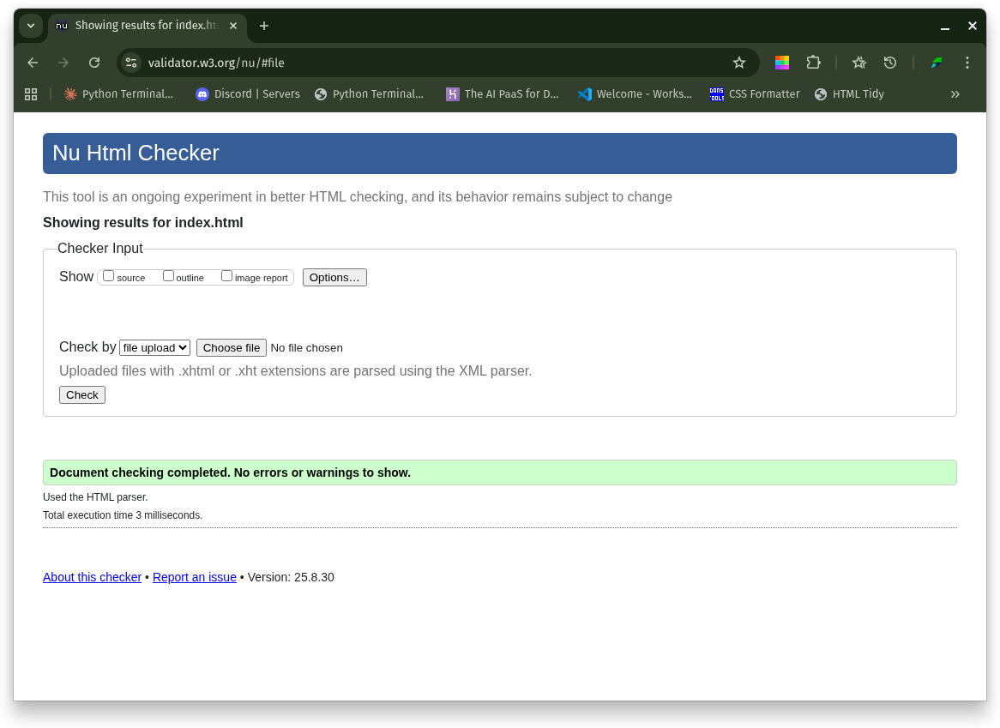
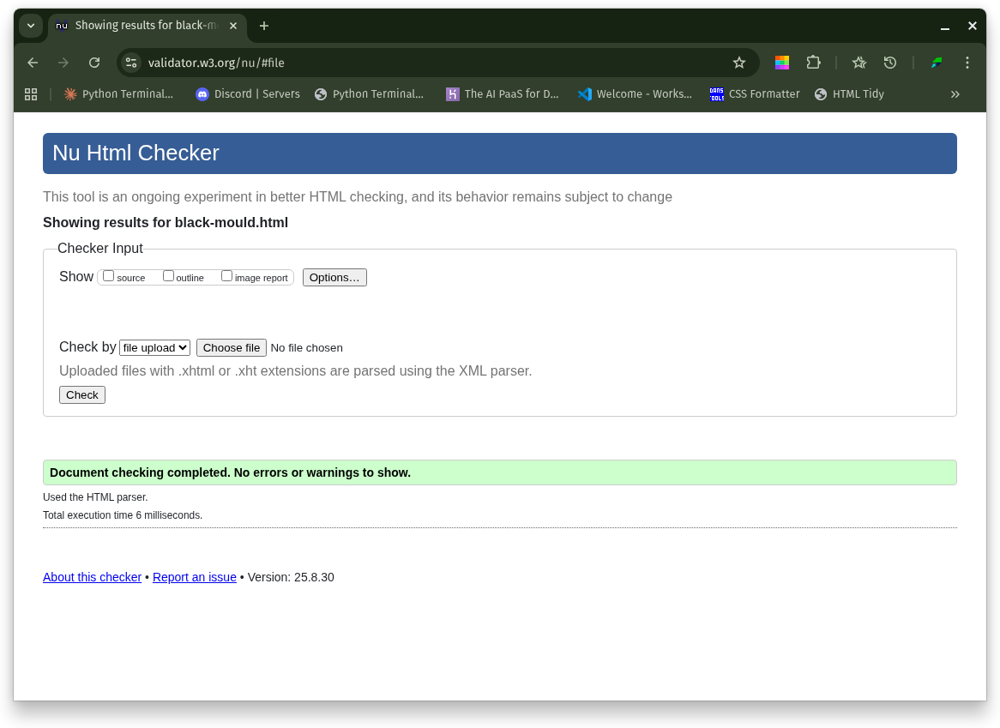
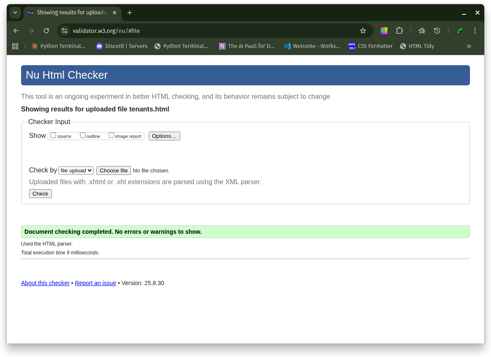
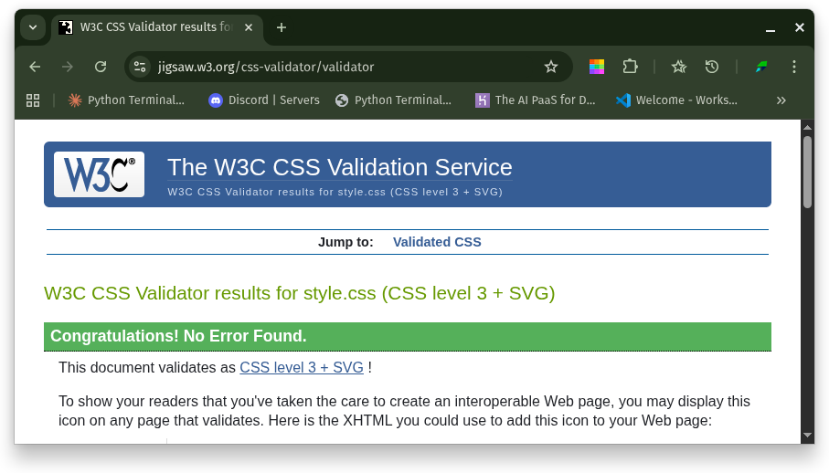
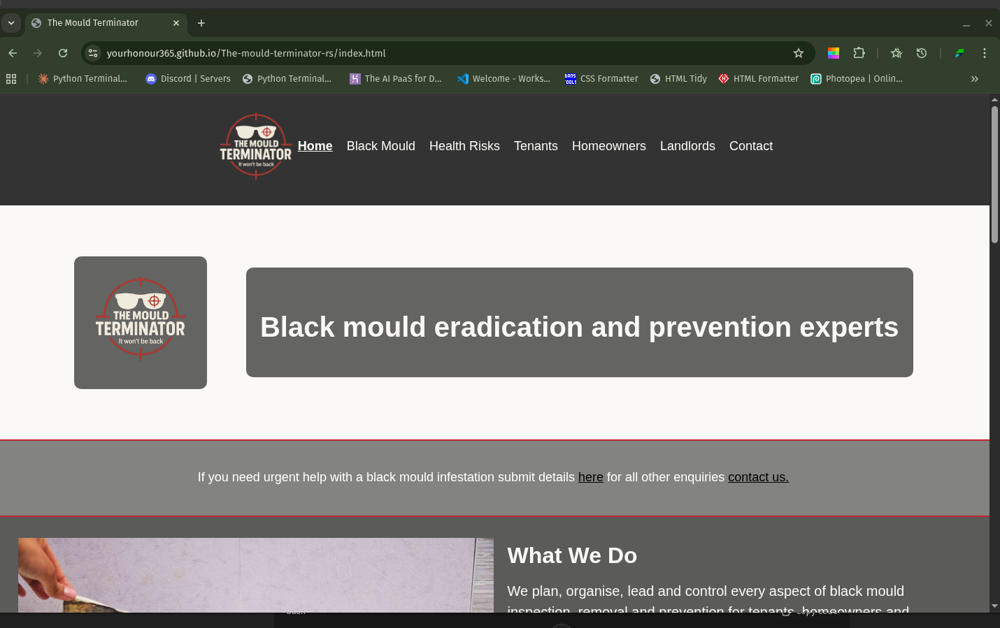
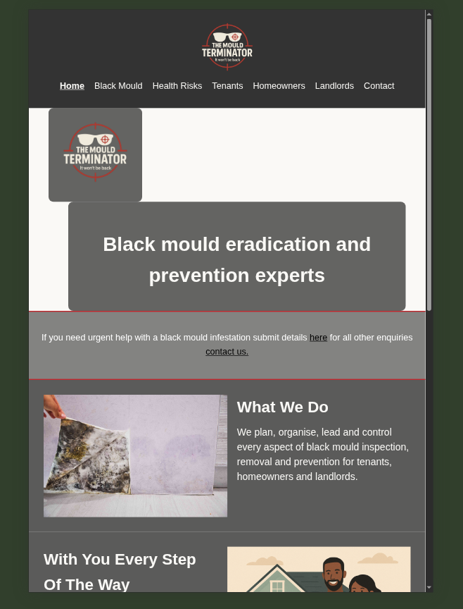

# Mould Terminator Website

Welcome to the official repository for the **Mould Terminator** website —
your trusted resource for mould prevention, removal, and healthy living guides.

---

## About

Mould Terminator is a dedicated website helping **homeowners, tenants, and landlords** tackle mould problems effectively.

Our website provides **clear, jargon-free advice**, **practical solutions**, and **trusted services** to eradicate mould and prevent it from coming back.

---

## Website Features

- **Educational Content**
  Learn about the causes, risks, and solutions for black mould and other damp-related issues.

- **Visual Guides**
  Infographics and illustrations to help you identify and prevent mould growth.

- **Service Information**
  Details about professional mould removal, ventilation improvements, and damp-proofing solutions.

- **Contact & Booking**
  Easy ways for customers to get in touch or request a free consultation.

- **Legal Guide**
  Know your rights and responsibilities as a tenant or landlord.

---

## Tech Stack
- **HTML5 & CSS3** — For responsive and semantic web structure.
- **Accessibility** — Focus on clear navigation, proper ARIA labels, and responsive design.

## Deployment

This project is deployed using **GitHub Pages**.

🔗 **Live Site:** [The Mould Terminator Website](https://yourhonour365.github.io/The-mould-terminator-rs/)

### How to run locally

To clone and run this project locally:

1. Open your terminal and clone the repository, then move into the folder:
   git clone https://github.com/Yourhonour365/The-mould-terminator-rs.git
   cd The-mould-terminator-rs

2. Open the `index.html` file in your preferred web browser.

## Testing

### HTML Validation
All pages were tested using the official W3C Markup Validation Service.

**Index page result:**

**Contact page result:**

**Black mould page result:**

**Health risks page result:**

**Homeowners page result:**

**Landlords page result:**

**Tenants page result:**

### CSS Validation
The CSS file was tested using the W3C Jigsaw CSS Validator.

### Responsiveness
The website was manually tested on multiple screen sizes (desktop, tablet, mobile).

**Desktop view:**

**Tablet view:**

**Mobile view:**

### Manual Testing
- Navigation links work correctly and open the correct pages.
- Images load as expected on all pages.
- Contact form inputs accept text, email, and phone number correctly.
- Footer content displays consistently across all pages.
- aria-current highlights the active page in the navigation menu.

### Bugs Fixed
- Removed `target="_blank"` from internal navigation links.
- Fixed unclosed HTML tags to pass validation.
- Corrected image paths to display properly on GitHub Pages.
## Features

### Implemented Features
- **Responsive Navigation**: Consistent navigation bar across all pages, with the current page highlighted.
- **Hero Section**: Prominent hero banner with logo and tagline on the homepage.
- **Educational Content**: Clear explanations of black mould, its causes, and associated health risks.
- **Audience-Specific Pages**: Separate guidance for tenants, homeowners, and landlords.
- **Contact Page**: Accessible form with required fields for urgent issues, plus email, phone, and WhatsApp options.
- **Resources Section**: Internal links to related pages for further reading.
- **Accessibility Enhancements**: Added ARIA labels, `aria-current`, alt text for images, and semantic HTML structure.
- **Validation Compliance**: All pages pass W3C HTML and CSS validation.
- **Responsive Design**: Fully responsive on desktop, tablet, and mobile devices.

### Future Enhancements
- Add video content explaining black mould prevention.
- Include a FAQ section for common tenant/landlord questions.
- Add a blog/news section for up-to-date health and housing updates.
- Implement a booking form for consultations.
- Expand resources with downloadable PDF guides.

---

## Credits

### Content
- All written content was created by me for educational purposes as part of the Code Institute Portfolio Project.
- Legal and health-related references were inspired by UK government guidance and NHS resources.

### Media
- Hero and example mould images sourced from free stock photo libraries (Unsplash / Pixabay) unless otherwise stated.
- Infographics and diagrams created by me.
- Logos and branding assets created specifically for this project.

### Articles Referenced
- [Independent – Black mould linked to baby hospital admissions](https://www.independent.co.uk/tv/news/black-mould-panorama-baby-hospital-admissions-b2695729.html)
- [BBC News – Awaab Ishak case](https://www.bbc.co.uk/news/uk-63642856)

### Acknowledgements
- Thanks to Code Institute for the project brief and assessment criteria.
- Assistance with debugging, accessibility, and project structuring provided by **ChatGPT (OpenAI)** and **Claude AI (Anthropic)**.

